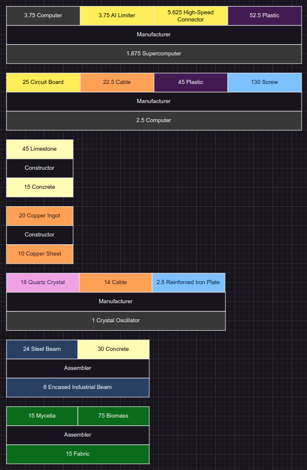

# SatisParsery
**Convert Satisfactory recipes data into Drawio diagram (list of recipes).**

Purpose of the project is making life easier when planning factories for those who don't like "I'll do it completely for you" tools.



## Table of contents

1. [Dependencies](#dependencies)
    - [SatisfactoryTools](#satisfactorytools)
    - [JSON for modern C++](#json-for-modern-c)
2. [Building with CMake](#building-with-cmake)
3. [Usage](#usage)
    - [data.json](#datajson)
    - [configuration.json](#configurationjson)
    - [output.drawio](#outputdrawio)
4. [Additional tools](#additional-tools)
    - [Acquiring readable names](#acquiring-readable-names)
6. [Known issues](#known-issues)
    - [Random sorting in configuration](#random-sorting-in-configuration)
    - [Windows support](#windows-support)
    - [readable_names.sh prints links](#readable_namessh-prints-links)

## Dependencies

### [SatisfactoryTools](https://github.com/greeny/SatisfactoryTools)

The repository has data.json file which lists all the recipes available in the game. I use this file to generate the diagram.

### [JSON for modern C++](https://github.com/nlohmann/json)

I use the library for parsing and writing JSON files.

## Building with CMake

```
git clone https://github.com/andev0/SatisParsery --recursive
mkdir SatisParsery/build
cd SatisParsery/build
cmake ..
make
```

## Usage

```
SatisParsery \
    path/to/data.json \
    path/to/configuration.json \
    path/to/output.drawio
```

### data.json

[The file](#satisfactorytools) from the SatisfactoryTools repository.

### configuration.json

Configuration file in which you can change the following things:
- Readable names of items and buildings (e.g. *"Smart Plating"* instead of *"Desc_SpaceElevatorPart_1_C"*)
- Ignored recipes
- Drawio styles of the elements (e.g. colors)

An example can be found in `example_configuration.json`.

### output.drawio

Path to which resulting diagram will be written.

## Additional tools

### Acquiring readable names

Readable names for [the configuration file](#configurationjson) can be fetched from [satisfactory-calculator.com](https://satisfactory-calculator.com) using the `readable_names.sh` Bash script. It works only on Linux.
## Known issues

### Random sorting in configuration

Every time you launch the program, it rearranges configuration file arrays' items in random order. I don't know how to fix it yet.

### Windows support

I didn't test the program on Windows thus can't guarantee that the program compiles and works on this OS.

### readable_names.sh prints links

Currently the script can't deal with names of alien remains and buildings. There are not much of them so it should make a big deal but maybe I figure out how to fix this soon.
